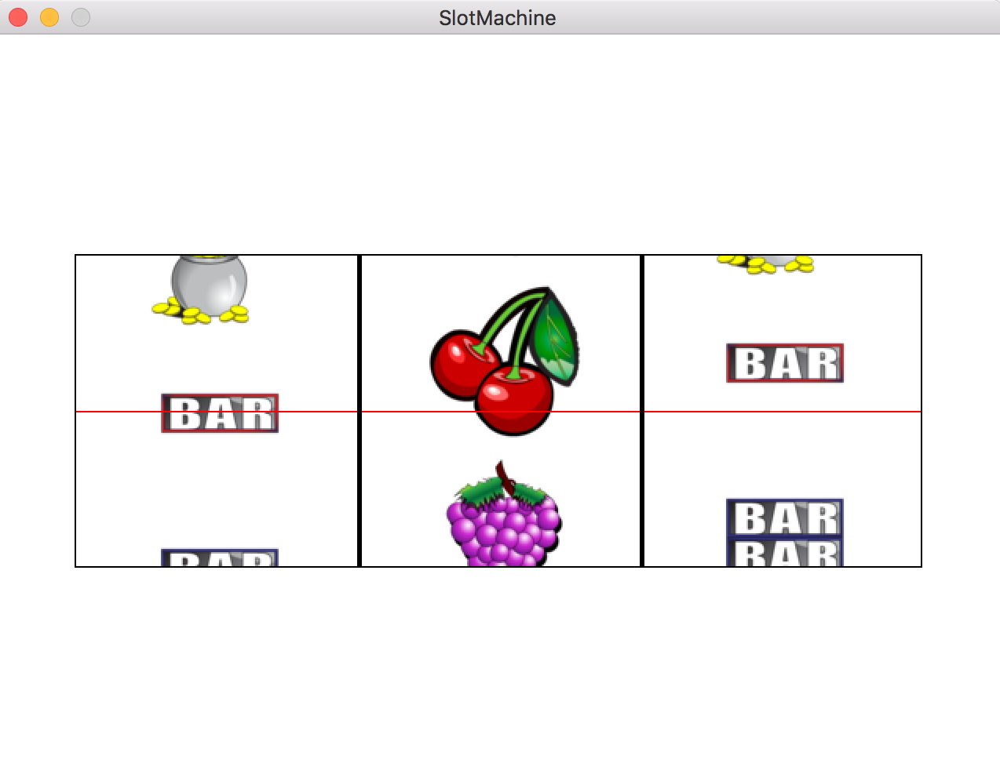

Slot machine
---

Slot machine game using [SDL2](https://www.libsdl.org/).

Install
---
```bash
# if on linux I think these should work
$ apt-get install libsdl2-dev libsdl2-image-dev libsdl2-mixer-dev
# if OSX
$ brew install SDL2 SDL2_image SDL2_mixer
```

Run
---
```bash
$ make
$ ./a.out
```

And then hit "space" to make the slot machine run. Has a nice sound when you win. Just try and see :).

Here's a preview:


